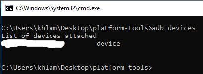

# ⚠️ WARNING:⚠️
THESE COMMANDS *WILL BREAK THE FOLLOWING FEATURES*. PROCEED AT YOUR OWN RISK.
1. Profile Isolation (ex. Work Profile) apps - Apps like [Island](https://play.google.com/store/apps/details?id=com.oasisfeng.island&hl=en_US) and [Shelter](https://play.google.com/store/apps/details?id=net.typeblog.shelter&hl=en_US) 🚨 *WILL BOOTLOOP YOUR PHONE* 🚨
2. Anything to do with the Galaxy Store - Links will not work.

The following features will work as normal.
1. All Android stock features (apps, Google services, phone, sms, camera, etc.)
2. Galaxy Wearable Apps that can be downloaded from the Google Play Store

### Debloat Samsung Android via ADB

This repository contains a list of adb commands to remove bloatware from Samsung Android devices. Keep in mind running all these commands will remove everything Samsung, including the galaxy store, themes, etc. down to barebones Android. Use at your own risk and read over all commands to make sure you don't take out something you need. While these commands cannot harm your device, there may be situations where your phone gets into a loop and your only option is to perform a factory reset.

The effect of running these adb commands is roughly equilivent to what [Package Disabler Pro+ (Play Store Link)](https://play.google.com/store/apps/details?id=com.elmklmsamsung.batteryaddon&hl=en_US) does, except you're running commands manually so you don't need to give an app device admin permission.

Running all commands listed in [commands.txt](./commands.txt) will **uninstall** all Samsung services, Facebook services, Google apps, Bixby, and most pre-installed bloatware.
These commands will not disrupt Samsung Knox. These commands will **remove** the Galaxy Store (everything including themes) and Samsung Pay.

> ⚠️ Research each package before deleting it. Some apps have hidden dependencies.

Removing or disabling `com.samsung.android.provider.filterprovider` **will cause the stock Samsung camera app to crash**.

### How?
The following instructions assumes you are familiar with using a command-line interface.
1. Enable Android "Developer Options"
2. Turn on "USB Debugging"
3. Download [Android SDK Platform-Tools](https://developer.android.com/studio/releases/platform-tools) for your OS.
4. Extract [Android SDK Platform-Tools](https://developer.android.com/studio/releases/platform-tools) and start a command-prompt/shell session in the extracted folder's directory.
5. Connect your Samsung Android phone to your computer with USB debugging enabled. Verify that adb sees your device and the daemon is running with the following command
    - `adb devices`
    - You should see the device name listed as a "device".
    
    
    

6. Enter your device's shell with the following command
    - `adb shell`
7. Once in the device's shell, copy and paste all desired commands from [commands.txt](./commands.txt) to remove the package. 

### Sources
- https://forum.xda-developers.com/showpost.php?p=73894621&postcount=23
